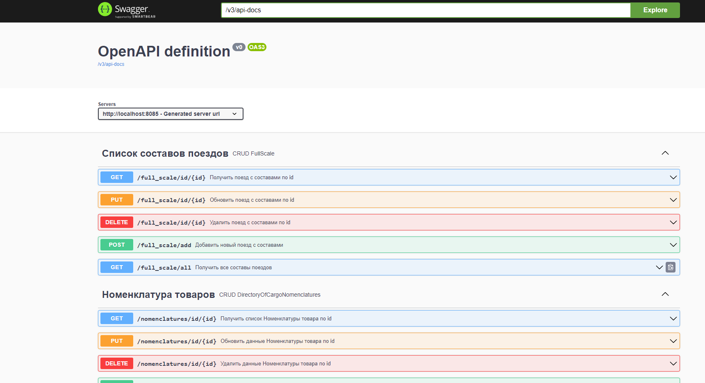
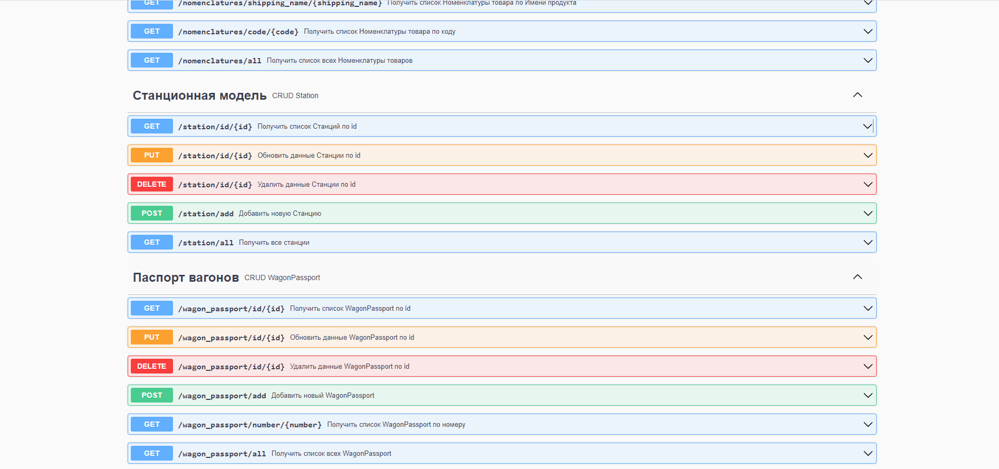
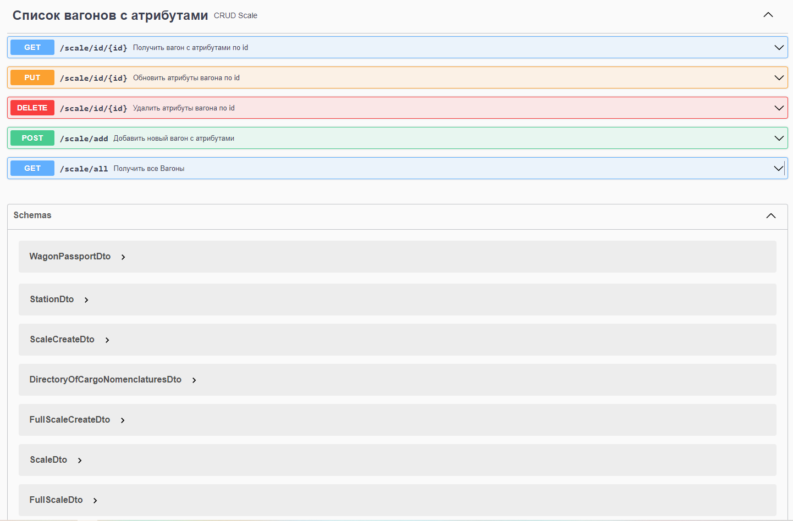
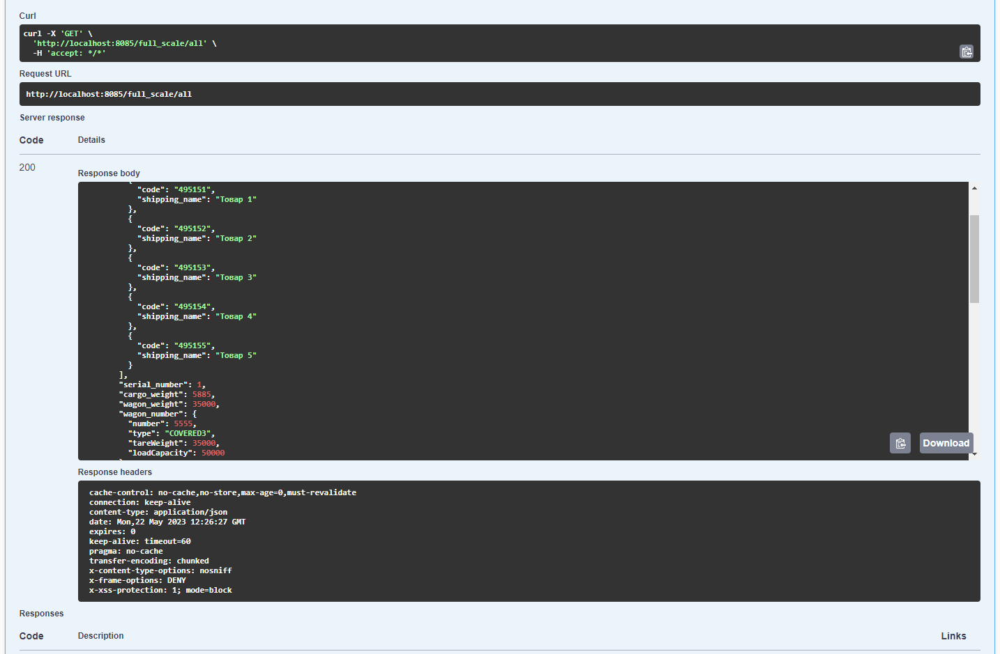

## 1. Docker-compose для запуска БД

```yaml
version: "3.8"
services:

  zrd-postgres:
    image: "postgres:14"
    container_name: "rzd-postgres"
    ports:
      - 5432:5432
    environment:
      - POSTGRES_USER=user
      - POSTGRES_PASSWORD=password
      - POSTGRES_DB=rzd-postgres
    volumes:
      - ./postgresql/init.sql:/docker-entrypoint-initdb.d/init.sql

```

- Для запуска используем `docker-compose up`

## 2. Авторизация

```text
Логин       Пароль      Доступ

Pasha   -   Pasha1234   USER
Dima    -   Dima1234    GUEST
Olga    -   Olga1234    ADMIN


```

## 3. Настройка OpenAPI definition

- Для доступа требуется перейти по следующем ссылкам

http://localhost:8085/swagger-ui/index.html

http://localhost:8085/swagger-ui.html








## 4. Миграции Flyway создания БД 

**Создание таблиц**

```sql

create table directory_of_cargo_nomenclatures
(
    id              int4 generated by default as identity,
    code            varchar(255),
    shipping_name   varchar(255),
    nomenclature_id int4,
    primary key (id)
);

create table full_scale
(
    id                 int4 generated by default as identity,
    composition_number int4,
    primary key (id)
);

create table scale
(
    id            int4 generated by default as identity,
    cargo_weight  numeric(19, 2),
    serial_number int4,
    wagon_weight  numeric(19, 2),
    wagon_number  int4,
    scale_id      int4,
    primary key (id)
);

create table station_model
(
    id           int4 generated by default as identity,
    station_name varchar(255),
    primary key (id)
);

create table station_entity_number
(
    station_entity_id int4 not null,
    number            int4
);

create table wagon_passport
(
    id            int4 generated by default as identity,
    load_capacity int4,
    number        int4,
    tare_weight   int4,
    type          varchar(255),
    primary key (id)
);

alter table if exists directory_of_cargo_nomenclatures
    add constraint UK_ebq73euxlhrc77sm8oj9ss77t unique (code);

alter table if exists directory_of_cargo_nomenclatures
    add constraint UK_c4re2lej8od96witk62ianbjt unique (shipping_name);

alter table if exists full_scale
    add constraint UK_gs9ctyrdr1ltwau5362nfb66k unique (composition_number);

alter table if exists station_model
    add constraint UK_4wymobyha9jcye1d0xkyb25mc unique (station_name);

alter table if exists wagon_passport
    add constraint UK_3b32orqd2ocyvshbkak79y66x unique (number);

alter table if exists directory_of_cargo_nomenclatures
    add constraint FK7t66fbfwa0u9ti2axtv2895y3 foreign key (nomenclature_id) references scale;

alter table if exists scale
    add constraint FKj075kbiqyo6u5ehaqk0ltkmpc foreign key (wagon_number) references wagon_passport;

alter table if exists scale
    add constraint FKa7e26610xudyrjycduwvrwbc3 foreign key (scale_id) references full_scale;

alter table if exists station_entity_number
    add constraint FKnsy1n6ypcbkkuvn4vaea3i0ek foreign key (station_entity_id) references station_model;

```

**Заполнение таблиц данными**

```sql

INSERT INTO station_model (station_name)
VALUES ('Ярославский вокзал'),
       ('Казанский вокзал'),
       ('Ленинградский вокзал'),
       ('Киевский вокзал'),
       ('Павелецкий вокзал');
INSERT INTO station_entity_number (station_entity_id, number)
VALUES (1, 1),
       (1, 2),
       (1, 3),
       (1, 4),
       (2, 1),
       (2, 2),
       (2, 3),
       (2, 4),
       (3, 1),
       (3, 2),
       (3, 3),
       (3, 4),
       (4, 1),
       (4, 2),
       (4, 3),
       (4, 4),
       (5, 1),
       (5, 2),
       (5, 3),
       (5, 4);
INSERT INTO wagon_passport (LOAD_CAPACITY, NUMBER, TARE_WEIGHT, TYPE)
VALUES (94000, 1111, 31000, 'SEMI_WAGON1'),
       (69000, 2222, 22000, 'SEMI_WAGON2'),
       (66000, 3333, 23000, 'COVERED1'),
       (68000, 4444, 22800, 'COVERED2'),
       (50000, 5555, 35000, 'COVERED3');

insert into scale (cargo_weight, wagon_weight, wagon_number)
values (5885, 35000, 5),
       (5885, 35000, 5),
       (5885, 22800, 4),
       (5885, 22800, 4),
       (5885, 23000, 3),
       (5885, 23000, 3);


INSERT INTO directory_of_cargo_nomenclatures(code, shipping_name, nomenclature_id)
VALUES ('495151', 'Товар 1', 1),
       ('495152', 'Товар 2', 1),
       ('495153', 'Товар 3', 1),
       ('495154', 'Товар 4', 1),
       ('495155', 'Товар 5', 1),
       ('495156', 'Товар 6', 2),
       ('495157', 'Товар 7', 2),
       ('495158', 'Товар 8', 2),
       ('495159', 'Товар 9', 3),
       ('495160', 'Товар 10', 4),
       ('495161', 'Товар 11', 4),
       ('495162', 'Товар 12', 5),
       ('495163', 'Товар 13', 5),
       ('495164', 'Товар 14', 6),
       ('495165', 'Товар 15', 6),
       ('495166', 'Товар 16', 6),
       ('495167', 'Товар 17', 6);

INSERT INTO full_scale(composition_number)
values (585496);

update scale
SET scale_id=1
where id < 4;

update scale
set serial_number=1
where id = 1;

update scale
set serial_number=2
where id = 2;

update scale
set serial_number=3
where id = 3;


```


## 5. CRUD операции для Контролеров написаны в следующем стиле:

```java

@RestController
@RequestMapping("wagon_passport/")
@RequiredArgsConstructor
@Tag(name = "Паспорт вагонов", description = "CRUD WagonPassport")
public class WagonPassportController {

    private final WagonPassportService wagonPassportService;

    @GetMapping("id/{id}")
    @Secured({"ROLE_ADMIN", "ROLE_USER", "ROLE_GUEST"})
    @Operation(summary = "Получить список WagonPassport по id")
    public ResponseEntity<WagonPassportDto> getWagonPassport(
            @Parameter(description = "Уникальный параметр")
            @PathVariable("id") Integer id) {
        var result = wagonPassportService.getWagonPassport(id);
        return result.map(
                        wagonPassportDto -> new ResponseEntity<>(
                                wagonPassportDto, HttpStatus.OK))
                .orElseGet(() -> new ResponseEntity<>(HttpStatus.BAD_REQUEST));
    }

    @GetMapping("number/{number}")
    @Secured({"ROLE_ADMIN", "ROLE_USER", "ROLE_GUEST"})
    @Operation(summary = "Получить список WagonPassport по номеру")
    public ResponseEntity<WagonPassportDto> getWagonPassportByNumber(
            @Parameter(description = "Номер вагона")
            @PathVariable("number") int number) {
        var result = wagonPassportService.getWagonPassportByNumber(number);
        return result.map(
                        wagonPassportDto -> new ResponseEntity<>(
                                wagonPassportDto, HttpStatus.OK))
                .orElseGet(() -> new ResponseEntity<>(HttpStatus.BAD_REQUEST));
    }

    @Secured({"ROLE_ADMIN", "ROLE_USER", "ROLE_GUEST"})
    @GetMapping("all")
    @Operation(summary = "Получить список всех WagonPassport")
    public ResponseEntity<List<WagonPassportDto>> getAllWagonPassport() {
        var result = wagonPassportService.getAllWagonPassport();
        return new ResponseEntity<>(result, HttpStatus.OK);
    }

    @PostMapping("add")
    @Secured({"ROLE_ADMIN", "ROLE_USER"})
    @Operation(summary = "Добавить новый WagonPassport")
    public ResponseEntity<Void> addWagonPassport(@RequestBody WagonPassportDto wagonPassportDto) {
        if (wagonPassportService.addWagonPassport(wagonPassportDto))
            return new ResponseEntity<>(HttpStatus.CREATED);
        return new ResponseEntity<>(HttpStatus.NOT_FOUND);
    }

    @PutMapping("id/{id}")
    @Secured({"ROLE_ADMIN", "ROLE_USER"})
    @Operation(summary = "Обновить данные WagonPassport по id")
    public ResponseEntity<Void> updateWagonPassport(
            @Parameter(description = "Уникальный параметр")
            @PathVariable("id") Integer id,
            @RequestBody WagonPassportDto wagonPassportDto) {
        if (wagonPassportService.updateWagonPassport(id, wagonPassportDto))
            return new ResponseEntity<>(HttpStatus.ACCEPTED);
        return new ResponseEntity<>(HttpStatus.NOT_IMPLEMENTED);
    }

    @Operation(summary = "Удалить данные WagonPassport по id")
    @DeleteMapping("id/{id}")
    @Secured({"ROLE_ADMIN"})
    public ResponseEntity<Void> deleteWagonPassport(
            @Parameter(description = "Уникальный параметр")
            @PathVariable("id") Integer id) {
        if (wagonPassportService.deleteWagonPassport(id))
            return new ResponseEntity<>(HttpStatus.OK);
        return new ResponseEntity<>(HttpStatus.NOT_IMPLEMENTED);
    }
}
```


